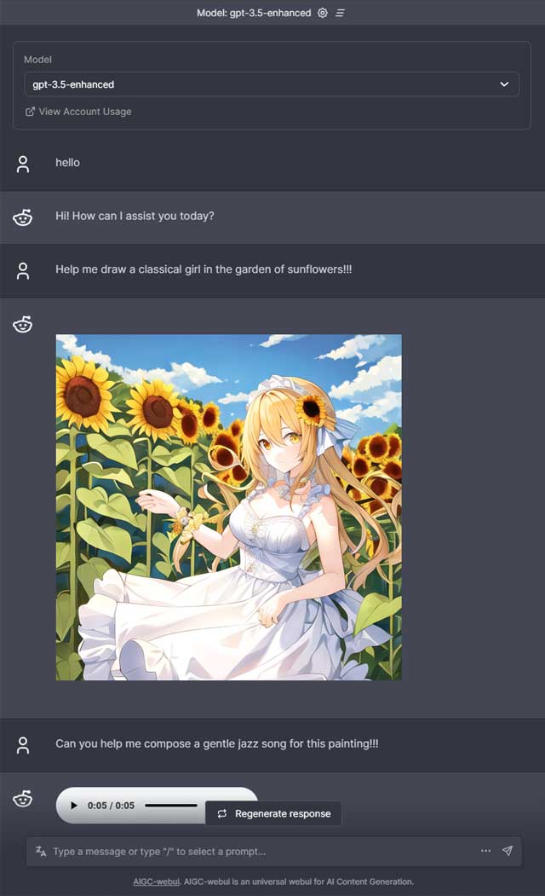

# AIGC-webui

[en](./README.md) | [中文](./docs/README_cn.md) | [हिंदी](./docs/README_in.md) | [español](./docs/README_es.md) | [العربية](./docs/README_ar.md) | [português](./docs/README_po.md) | [日本語](./docs/README_jp.md)

AIGC-webui is a universal interface for AIGC (AI Generated Content). For example, you can use it to make chatGPT work the way you like, to generate images / musics.

Screenshot:

### Features
 
- A variety of AIGC models to choose from, such as ChatGPT, LLaMA, Stable Diffusion，Riffusion, or some cool models you make by yourself.
- Multimodal generation ability, such as images, musics, code blocks, and so on.
- chatPDF, you can upload pdf files, and chat with the file in analysis mode.
- Comes with an addon, named `gpt3-5-enhanced`, that enrich ChatGPT with the ability to generate images and musics.
- Comes with an addin, named `translate`, that can translates user input automatically, and another plugin `beautify` than can optimize user's prompt for image generation.
- An extendable framework, easy to make your own extension. （[Guidelines](docs/Contributing.md)）
- predefined prompt shortcuts
- etc.

## Installation and Running

### For Windows User

You can **automatically install** and run this project  by simply double-clicking the `webui.bat` after downloading this project, or you may choose to install it manually by yourself:

1. Install [nodejs](https://nodejs.org) 
2. Install [git](https://git-scm.com/download/win).
3. Download this project: open the terminal (Windows + R, type "cmd" and press Enter), and execute `git clone https://github.com/hku/aigc-webui.git`
4. Install dependencies: Navigate into the project folder(`cd aigc-webui`), and execute `npm install`
5. Customize the environment:  make a copy of the example environment variables file `.env.local.example`, name it `.env.local`, Fill in the keys or tokens in the `.env.local` file. The meanings of the keys and the application links for them  are listed in the table below.

| environment variables         |  Free application links                | Usage                                            |
| --------------------- | ------------------------------ | ------------------------------------------------------- |
| OPENAI_API_KEY        |   <a href="https://platform.openai.com/account/api-keys" target="_blank">openai</a>    |For calling OpenAI's official API, required for the model `GPT-3.5` and `GPT-3.5-enhanced` shipped with this repository. |
| REPLICATE_API_TOKEN    | <a href="https://replicate.com" target="_blank">replicate</a>  | For calling replicate APIs，required for  `gpt3-5-enhanced`,`replicate-*` models |
| BAIDU_TRANSLATE_APPID, BAIDU_TRANSLATE_SECRET  | <a href="http://api.fanyi.baidu.com/product/11" target="_blank">baidu翻译</a>  | For calling Baidu translation API，required for the prompt modifiers `translate` and `beautify` shipped with this repository           |

6. deploy the web service, by execute `npm run dev`

Open the address in your browser: [http://localhost:3000](http://localhost:3000), enjoy!

### For Mac User

You can **automatically install** and run this project by excuting `sh webui_for_mac.sh`  after downloading this project, or you may choose to install it manually by yourself:

1. Install [nodejs](https://nodejs.org) 
2. Install [git](https://git-scm.com/book/en/v2/Getting-Started-Installing-Git).
3. Download this project: open the terminal, and execute：`git clone https://github.com/hku/aigc-webui.git`
4. Install dependencies: Navigate into the project folder(`cd aigc-webui`), and execute `npm install`
5. Customize the environment:  make a copy of the example environment variables file `.env.local.example`, name it `.env.local`, Fill in the keys or tokens in the `.env.local` file. The meanings of the keys and the application links for them  are listed in the table below.

| environment variables         |  Free application links                | Usage                                            |
| --------------------- | ------------------------------ | ------------------------------------------------------- |
| OPENAI_API_KEY        |   [openai](https://platform.openai.com/account/api-keys)     |For calling OpenAI's official API, required for the model `GPT-3.5` and `GPT-3.5-enhanced` shipped with this repository. |
| REPLICATE_API_TOKEN    | [replicate](https://replicate.com)       | For calling replicate APIs，required for  `gpt3-5-enhanced`,`replicate-*` models |
| BAIDU_TRANSLATE_APPID, BAIDU_TRANSLATE_SECRET  | [Baidu Translate](http://api.fanyi.baidu.com/product/11)  | For calling Baidu translation API，required for the prompt modifiers `translate` and `beautify` shipped with this repository           |

6. deploy the web service, by execute `npm run dev`

Open the address in your browser: [http://localhost:3000](http://localhost:3000), enjoy!

## Develop Your Own Extensions

aigc-webui has a simple pluggable structure. You can develop your own extensions easily，Check [guidelines](docs/Contributing.md)

## Credits
- openai - https://github.com/openai/openai-cookbook
- Chatbot UI - https://github.com/mckaywrigley/chatbot-ui
- Nextjs - https://github.com/vercel/next.js
- Replicate - https://github.com/replicate/replicate-javascript
- Stable Diffusion - https://github.com/CompVis/stable-diffusion
- LlaMA - https://github.com/facebookresearch/llama
- (You)

### Contact

If you have any questions, feel free to reach out to me on [Facebook](https://www.facebook.com/kun.huang.750).