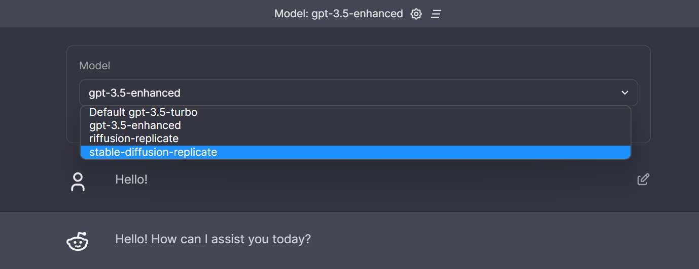
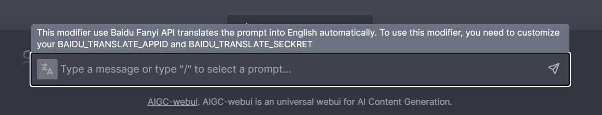
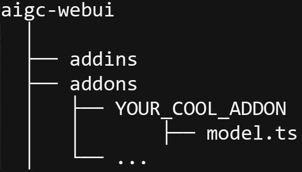
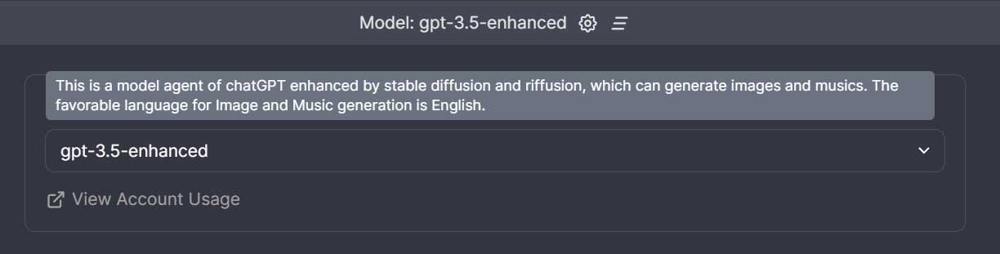
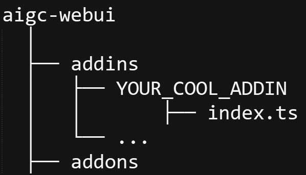

# Contributing Guidelines

The goal of aigc-webui project is to build an elegant extensible UI client for everyone to make AIGC technologies easily accessible. 

## Get Started

### how to deploy the project

```bash
git clone https://github.com/hku/aigc-webui.git 
cd aigc-webui
npm install 
npm run dev
```
### how to Contribute Code

We appreciate your interest in this project. Here are the general steps to contribute:

1. Fork the project on GitHub.
2. Clone your forked repository locally on your machine. 
3. Create a new branch from the main branch.
4. Make your changes on the new branch.
5. Ensure that your changes adhere to our code style guidelines and pass our automated tests.
6. Commit your changes and push them to your forked repository.
7. Submit a pull request to the main branch of the main repository.

We welcome all kinds of contributions, such as:

- Exensions
- Code optimizations
- Bug fixes
- Documentation improvements
- Translations
- etc.

To make a standalone extension, please follow the guidelines below. 

## How to make Extensions

Currently, two types of extensions are supported for AIGC-webui, which are placed in two separate sub-folders, i.e., `addons` and `addins`.

- **addons**: They are agents for AI models at the backend, for example, we provide agents for chatGPT, LlaMA, Stable Diffsion, Riffusion, and ChatGPT-ehanced, which enhance ChatGPT with ability to generate images and melodies. 

Users can access your addon through a selector located in the header of webui:



- **addins**: they make modifications to the user inputs (i.e., text prompts) before the prompts are send to the AIGC models, such as translating user's text input, or optimizing the prompts for special tasks, such as image generation. 

Users can access your addin in the prefix of the input box here:



### <a name="addon"></a> Make an `addon`

(1) create a folder in `addons` named saying `YOUR_COOL_ADDON`, and a script named 'model.ts' in `YOUR_COOL_ADDON`, other scripts of your addon should be all placed in `YOUR_COOL_ADDON`.

the folder trees now looks like:



(2)  **`model.ts`** exports a plain object called `metadata` and a `default` function:

```typescript
export const metadata = {
    name: 'a cool name',
    description: 'this is a cool model agent',
}

export default async function generate(messages: Message[], system_prompt=''){
  
  const result: string | ReadableStream = ...
  
  return result
}
```

- `metadata` describes your extension which is automatically loaded into the webui at the model selector:

  

- `default` function produces the generated result, which receives two parameters: `messages` and `system_prompt`, and returns a result with the type `string` or `ReadableStream`. 
- `messages: Message[]` represent the full chat history of a conversation, which has a structure:

```typescript
type Role = 'assistant' | 'user';

interface Message {
  role: Role; 
  content: string;
}

``` 
- `system_prompt: string`  defines the main context of the conversation. It plays the role similar to 'system message' in chatGPT API or the 'instruction' in LlaMA models. 

- `result: string | ReadableStream` defines the answer of the model. If you want a image result, your can return a markdown string like `''` 

(3) `YOUR_COOL_ADDON` will be automatically loaded by the webui when deployed. Full examples can be found in the folder `addons`, such as `addons/gpt3-5` or `addons/gpt3-5-enhanced`. 

### <a name="addin"></a> Make an `addin`

(1) create a folder in `addins` named saying `YOUR_COOL_ADDIN`, and a script named 'index.ts' in `YOUR_COOL_ADDIN`, other scripts of your addin should be all placed in `YOUR_COOL_ADDIN`.

the folder trees now looks like:




(2)  **`index.ts`** exports a plain object called `metadata` and a function called `after_input`:

```typescript
export const metadata = {
    name: 'a cool name',
    description: 'this is a cool prompt modifier',
}

export const after_input = async (prompt: string) => {
  const result: string = ...
  return result
}
```

- `metadata` describes the prompt modifier, automatically loaded into the webui at the prefix of the input:

  

- `after_input` function produces the modified prompt, which receives a string parameter `prompt` , and returns a result with the type `string`. 
- `prompt: string`  denotes the original text input of the user.
- `result: string` defines the final text result after modification.

(3) `YOUR_COOL_ADDIN` will be automatically loaded by the webui when deployed. Full examples can be found in the folder  `addins` of the project. 


All exentions are now devolped in typescript, and we plan to support python extensions soon!


